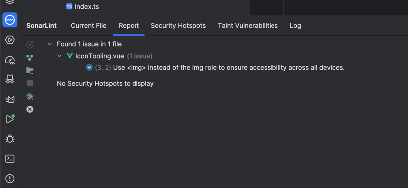

# Hosted on Firebase
webapp: https://plus2gratis-8fc51.web.app
cloud funs: check functions folder

# Security
Using Firebase for Auth and Firestore for a database ensures that the data is secure and can be accessed only by the authenticated users.
Furthermore there are [firestore.rules] added which ensures data manipulation is controlled.

NPM Audit was run to check for any vulnerabilities.
Types were added to ensure type safety.

API keys are stored in firebase config
All third party calls are happening on the server side(Cloud functions).

The exposed API error you see on github should be ignored because its acceptable to publish the API key for this project 
as its usage is controlled by security rules and from firebase console.
GCloud only allows firebase hosting domain to access the API key.

# Shift left security
- NPM audit
- ESLint
- Typescript
- Using latest versions of libraries, that are "fresh"
- Pull request reviews
- Only certain people have access to the firebase console and git write access
- SonarLint
